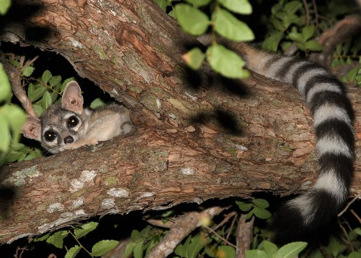

### Hi there 👋 My name is Jeronimo Miranda. I am a bioinformatician, data analyst and scientist interested in most things having to do with genomics, microscopy and cell biology and all technologies that can help us get better health.

- 🔭 I’m currently working on ...
  [FitBit Fitness Tracker Data](https://www.kaggle.com/datasets/arashnic/fitbit)
  
- 💬 Ask me about ...

[Species Geographic Distribution Data](https://github.com/jerolon/distribucion_de_cacomixtles)
<!--
**jerolon/jerolon** is a ✨ _special_ ✨ repository because its `README.md` (this file) appears on your GitHub profile.

Here are some ideas to get you started:

- 🌱 I’m currently learning ...
- 👯 I’m looking to collaborate on ...
- 🤔 I’m looking for help with ...

- 📫 How to reach me: ...
- 😄 Pronouns: ...
- ⚡ Fun fact: ...
-->
